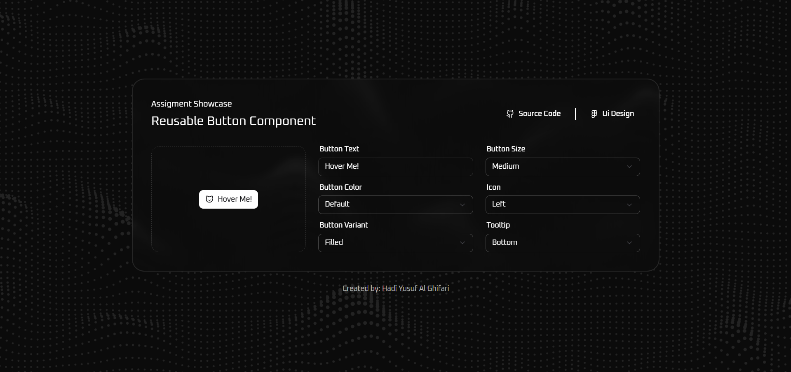

---

````md
# 🚀 Button Component – Assignment Test

This is a **reusable, dynamic Button component** built with modern tech stack. It's designed to be flexible and easily customizable, making it a solid foundation for any design system or front-end project.

---

## ✨ Features

- 🔥 Supports multiple variants (`default`, `outline`, `ghost`, etc.)
- 🎨 Color themes: `default`, `danger`, `warning` (extendable)
- 📐 Multiple sizes: `sm`, `default`, `lg`, `icon`
- 💡 Icon support using [Lucide Icons](https://lucide.dev/)
- ↔️ Icon positioning (`before`, `after`, `icon-only`)
- 💬 Optional tooltip with customizable position
- 🧠 Full TypeScript support with type-safe props
- 💅 Utility-first styling with Tailwind CSS
- 🧱 Built with class-variance-authority (CVA) for scalable variants
- 🌙 Dark mode ready

---

## 🛠️ Tech Stack

| Tool                                                                     | Description                                      |
| ------------------------------------------------------------------------ | ------------------------------------------------ |
| [Bun](https://bun.sh)                                                    | Ultra fast JS runtime, bundler & package manager |
| [Vite](https://vitejs.dev)                                               | Next-gen frontend build tool                     |
| [React](https://react.dev)                                               | Component-based UI library                       |
| [Tailwind CSS](https://tailwindcss.com)                                  | Utility-first CSS framework                      |
| [shadcn/ui](https://ui.shadcn.com)                                       | Beautifully designed UI components               |
| [Lucide React](https://lucide.dev)                                       | Icon library for React                           |
| [class-variance-authority](https://cva.style/docs)                       | Manage class variants elegantly                  |
| [Radix UI Slot](https://www.radix-ui.com/docs/primitives/utilities/slot) | Slot component for flexible rendering            |

---

## 📦 Installation

```bash
bun install

```

Or if you're using Node:

```bash
npm install
# or
pnpm install
```

Then start the dev server:

```bash
bun run dev
```

---

## 🧪 Usage Example

```tsx
import { Button } from "@/components/ui/button";
import { CatIcon } from "lucide-react";

<Button
  variant="outline"
  color="warning"
  size="lg"
  icon={CatIcon}
  iconPosition="before"
  tooltip="Click me for a surprise"
>
  Hover Me!
</Button>;
```

---

## 🧰 Props

| Prop           | Type                                        | Description                        |
| -------------- | ------------------------------------------- | ---------------------------------- |
| `variant`      | `"default"` \| `"outline"` \| `"ghost"`     | Visual style of the button         |
| `color`        | `"default"` \| `"danger"` \| `"warning"`    | Theme color                        |
| `size`         | `"sm"` \| `"default"` \| `"lg"` \| `"icon"` | Size of the button                 |
| `icon`         | `LucideIcon`                                | Optional icon from lucide-react    |
| `iconPosition` | `"before"` \| `"after"` \| `"icon-only"`    | Placement of the icon              |
| `tooltip`      | `boolean`                                   | Show tooltip if string is provided |

## 🤝 Contribution

Feel free to fork, clone, and open PRs. This is designed to be a foundation you can build on!

---

## 🧑‍💻 Author

Made with 💻 by [@gipeeey](https://github.com/gipeeey)

---

## 📸 Preview



https://assignment-test-pt-dii.vercel.app/

---

## License

MIT – do whatever you want, just don't sell it to aliens 👽
